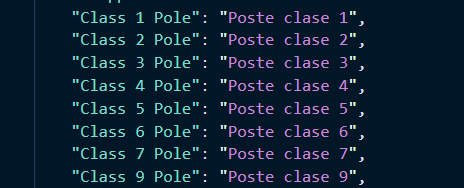

# Navigation Language Translation Script
This program will translate the question dictionaries within a navigation.JSON file and add them to a language configuration file. :smiley:

# Inspiration 
Some users of applications first language is not always English. We were told our decision trees are available in other languages so long that the question exists in that specific language's config file. This is a way to automate the process of adding the questions that exist in our decision trees to the config.JSON file.

# Installation 
git clone the repository. 

Packages:
```
import pandas as pd
import json
import PySimpleGUI as sg
from googletrans import Translator, constants
import argparse
from pathlib import Path
```

You can run the program using PySimpleGUI if license installed. Please see **[run w/ PySimpleGUI](#run-w-pysimplegui)** for instructions on running the program using the GUI and visit **[Licenses](#licenses)** to learn how to acquire PySimpleGUI. 

or 

You can run the program through the command line by assigning the file location in variables. Reference **[run w/ file location](#run-w-file-location)**

## run w/ PySimpleGUI
Run the program by using: `py append_translation_files.py -v`

Input a JSON file into the GUI window by clicking 'Browse'. The GUI will allow you to browse your computer files. Select the 'navigation_JSON_File.json' you wish to append questions in another language. Select the translation configuration .JSON file. Select a language you wish to translate to. Click 'Submit' and the new CSV file will be in your files where you set the directory in the terminal.

## run w/ file location
Run the program by using: `py append_translation_files.py -n c:/Users/DV0095/Documents/Python_Projects/translation/nav.json -t c:/Users/DV0095/Documents/Python_Projects/translation/config.json -l Spanish or Creole`

The variable `n` should be assigned the location where the navigation JSON file exists in the file path/directory. 
The variable `t` should be assigned the location where the language configuration JSON file exists in the file path/directory.
The variable `l` should be a string of the language you are translating to. Either Spanish or Creole.

The new config JSON file will be in your files where you set the directory in the terminal.

## Licenses
Submit an Altas Request to get a developer key for the PySimpleGUI library. 'Request New Approved Software'. The library should be an option to select under the approved softwares.

Add developer key: Run the program with PySimpleGUI (**run w/ PySimpleGUI**) and the interface will prompt you to copy and paste the key into a text box. I believe a new key will be needed one calendar year after purchase.

# Visuals

Image of the Spanish config.JSON file

